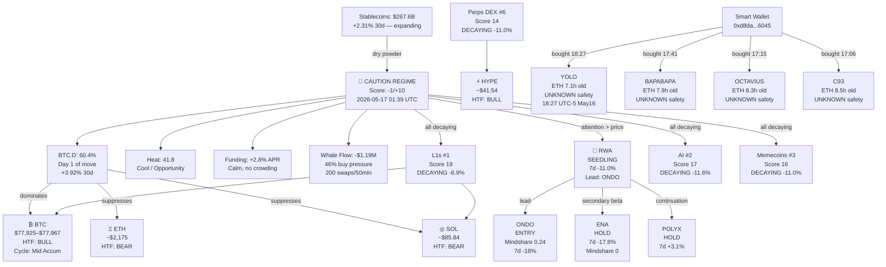

# Crypto Intelligence Knowledge Graph
**Last updated:** 2026-05-17 01:39 UTC  
**Source:** cryptowatch.id

---

## Entity Map



---

## Knowledge Nodes

### Regime Node
```
REGIME_20260517
  score: -1
  max: +10
  label: CAUTION
  heat: 41.8
  btc_dominance: 60.4%
  btc_dom_day: 1
  altcoin_breadth: 16%
  smart_money: idle
  whale_net_flow_50min: -$1.19M
  buy_pressure: 46%
  timestamp: 2026-05-17T01:39Z
```

### BTC Node
```
BTC_20260517
  price_range: [$77,925, $77,967]
  posture: WAIT (-1)
  confidence: 70%
  cycle_phase: mid_accumulation
  cycle_score: 39.9/100
  months_since_halving: 24.9
  days_to_next_halving: 705
  bottom_proximity: 28%
  bottom_radar: 84/100
  lth_accumulation_30d: +131,133 BTC
  etf_flow_7d: -$1.14B
  etf_flow_30d: +$1.50B
  key_levels:
    realized_price: $54,230
    lth_realized_price: $45,011
    tmm: $75,336
    sth_cost: $81,345
    ma_200w: $61,074
    max_pain: $79,000
    ema_50w: $85,809
    ema_20w: $78,270
  on_chain:
    mvrv_z: 0.9187
    nupl: 0.3297
    puell: 0.9953
    ahr999: 0.5286
    reserve_risk: 0.001214
    lth_mvrv: 1.685
    aviv: 1.035
    lth_sopr: 0.94
  options:
    dvol: 40.5
    skew_25d: -13.8
    vrp: +2.94
    iv_term: steep_contango
  macro:
    m2_yoy: +4.57%
    dxy_3m: -1.01%
    vix: 17.26
    hy_spread: 2.76%
    copper_90d: +19.1%
    stablecoin_supply: $267.6B
    eth_btc: 0.02918
```

### Smart Wallet Node
```
SMART_WALLET_0xd8da6045
  address: 0xd8da...6045
  buys_16may2026:
    - token: YOLO    | ca: 0xbb24...0468 | time: 16May 18:27 | age: 7.1h
    - token: BAPABAPA| ca: 0x7795...affe | time: 16May 17:41 | age: 7.9h
    - token: OCTAVIUS| ca: 0x1350...dced | time: 16May 17:15 | age: 8.3h
    - token: C93     | ca: 0x0c01...d497 | time: 16May 17:06 | age: 8.5h
  chain: eth-mainnet
  safety_all: UNKNOWN
  pattern: single_wallet_cluster_4_new_tokens_1day
  risk: HIGH — no safety verification
```

### Narrative Nodes
```
NARRATIVE_RWA
  rank: 7
  score: 11
  status: SEEDLING
  performance_7d: -11.0%
  lead_token: ONDO
  mindshare_status: leading_price
  signal: attention_before_price_setup
  plays:
    entry: ONDO (mindshare 0.24, 7d -18%)
    hold: ENA (7d -17.8%, zero mindshare)
    hold: POLYX (7d +3.1%, continuation only)

NARRATIVE_L1S
  rank: 1
  score: 19
  status: DECAYING
  performance_7d: -6.9%

NARRATIVE_MEMECOINS
  rank: 3
  score: 16
  status: DECAYING
  performance_7d: -11.0%

NARRATIVE_PERPS_DEX
  rank: 6
  score: 14
  status: DECAYING
  performance_7d: -11.0%
  lead: HYPE
```

---

## Relationship Map (Text)

```
REGIME(CAUTION -1)
├── driven_by → BTC.D(60.4% rising, day 1)
├── driven_by → WHALE_FLOW(-$1.19M net sell)
├── driven_by → SMART_MONEY(idle)
├── supported_by → HEAT(41.8 = opportunity zone)
├── supported_by → STABLECOINS($267.6B, +2.31%)
│
├── narrative_attention → RWA(SEEDLING)
│   ├── lead_token → ONDO [ENTRY: mindshare 0.24, 7d -18%]
│   ├── secondary → ENA [HOLD: 7d -17.8%, zero mindshare]
│   └── continuation → POLYX [HOLD: 7d +3.1%]
│
├── suppress → ALL_ALTS (BTC.D climbing)
│   ├── ETH/BTC = 0.02918 (structural downtrend, 16.5% below floor)
│   └── breadth = 16% (risk-off)
│
└── smart_ape_activity → 0xd8da...6045
    ├── YOLO (0xbb24...0468, 18:27 UTC)
    ├── BAPABAPA (0x7795...affe, 17:41 UTC)
    ├── OCTAVIUS (0x1350...dced, 17:15 UTC)
    └── C93 (0x0c01...d497, 17:06 UTC)

BTC_CYCLE
├── phase = Mid Accumulation (39.9/100)
├── bottom_radar = 84/100 (strong cluster)
├── lth = accumulating (+131K BTC/30d)
├── etf = distributing (-$1.14B/7d)
└── posture = WAIT (short-term flat, long-term accumulate)
```

---

## Trigger Conditions (Watch List)

| Trigger | Current | Threshold | Action |
|---------|---------|-----------|--------|
| BTC.D | 60.4% | > 61% | Pause RWA adds |
| BTC.D | 60.4% | < 55% (weekly close) | Altseason precondition |
| Heat Index | 41.8 | > 60 (without ONDO move) | Thesis broken — exit |
| Heat Index | 41.8 | < 35 | Reset — wait |
| ONDO range | — | Fails 3-5d | Cut entry |
| SM print | Idle | Any RWA accum | Size up |
| ENA mindshare | 0 | Ticks up | Rotation broadening |
| ETH/BTC | 0.02918 | > 0.034 | ETH overweight trigger 1/4 |

---

## Falsifiable Forecasts Log

| Date | Forecast | Ticker | Confidence | Resolution |
|------|----------|--------|------------|------------|
| 2026-05-17 | Leading narrative = RWA (T+1) | RWA | 55% | Pending |
| 2026-05-17 | Best major = BTC (T+1) | BTC | 55% | Pending |
| 2026-05-17 | Top gainer = BILL (T+1) | BILL | 35% | Pending |
| 2026-05-17 | ONDO outperforms BTC >5% (T+7) | ONDO | 45% | Pending |
| 2026-05-17 | Leading narrative = RWA (T+7) | RWA | 50% | Pending |
| 2026-05-17 | Deathtouch TCG survives as CT term (T+7) | — | 45% | Pending |
